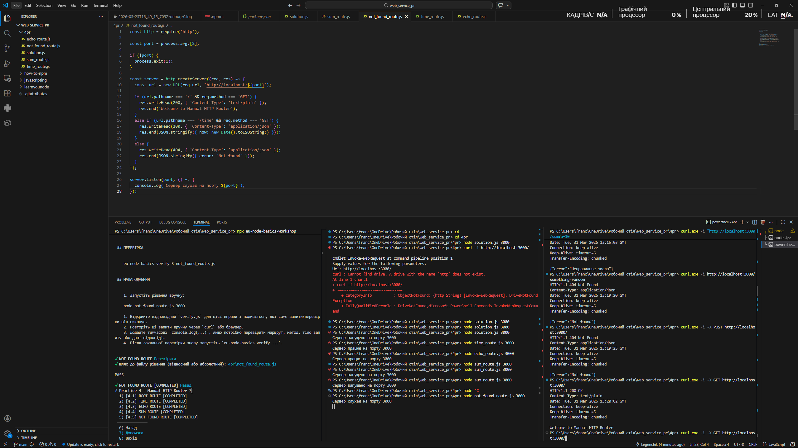
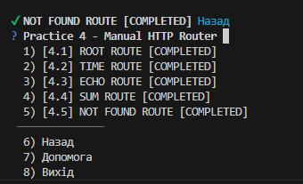
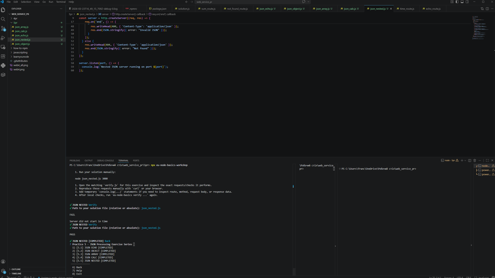
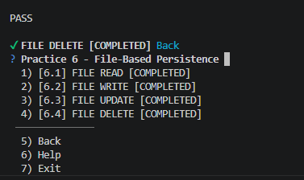
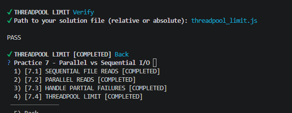
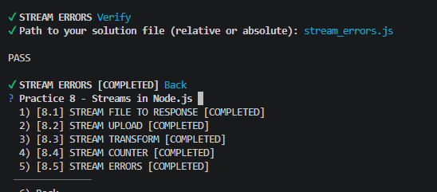
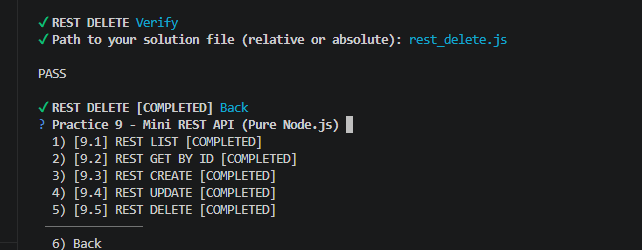
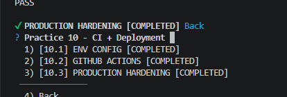

# Node.js HTTP Basics — Solutions

## 🚀 Виконані вправи

### Частина 1: HTTP Маршрутизація
У межах цього блоку було реалізовано 5 основних маршрутів:

1.  **01 - ROOT ROUTE**: Створення базового сервера, що відповідає "Welcome to Manual HTTP Router" на запит `GET /`.
2.  **02 - TIME ROUTE**: Ендпоінт `GET /time`, який повертає поточний час у форматі ISO JSON.
3.  **03 - ECHO ROUTE**: Обробка query-параметрів. Повертає значення параметра `msg` як plain text.
4.  **04 - SUM ROUTE**: Калькулятор суми. Обчислює `a + b` з query-параметрів та обробляє помилки (400 Bad Request).
5.  **05 - NOT FOUND ROUTE**: Універсальна обробка неіснуючих маршрутів з поверненням JSON помилки 404.

### Частина 2: Обробка JSON (POST запити)
Реалізовано ендпоінти для роботи з тілом запиту:
* **06 - JSON ECHO**: Повертає надісланий JSON об'єкт назад.
* **07 - JSON OBJECT**: Обробка об'єкта користувача та логіка `isAdult`.
* **08 - JSON ARRAY**: Обчислення суми, кількості та середнього значення масиву чисел.
* **09 - JSON CALC**: Динамічний калькулятор (`add`, `subtract`, `multiply`, `divide`).
* **10 - JSON NESTED**: Робота з вкладеними об'єктами та перевірка ролей користувача.
  

### Частина 3: Робота з файловою системою
Реалізовано ендпоінти для CRUD-операцій з файлами JSON:
* **16 - FILE READ**: Зчитування JSON-даних з файлу.
* **17 - FILE WRITE**: Збереження даних з тіла запиту у файл `data.json`.
* **18 - FILE UPDATE**: Оновлення елемента в масиві JSON за його `id`.
* **19 - FILE DELETE**: Видалення елемента з `data.json` за його `id`.

### Частина 4: Асинхронне введення/виведення (I/O)
Реалізовано роботу з файловою системою в асинхронному режимі та досліджено Threadpool:
* **21 - SEQUENTIAL FILE READS**: Послідовне читання кількох файлів через `fs/promises`.
* **22 - PARALLEL READS**: Паралельне читання файлів для оптимізації часу за допомогою `Promise.all(...)`.
* **24 - HANDLE PARTIAL FAILURES**: Обробка часткових помилок читання масиву файлів за допомогою `Promise.allSettled`.
* **25 - THREADPOOL LIMIT**: Симуляція важких асинхронних задач (через `crypto.pbkdf2`) для розуміння лімітів пулу потоків Node.js.

### Частина 5: Робота з потоками (Streams)
Реалізовано ефективну обробку великих обсягів даних за допомогою потоків:
* **11 - STREAM RESPONSE**: Стрімінг локального файлу безпосередньо у HTTP-відповідь (`fs.createReadStream()`).
* **12 - STREAM UPLOAD**: Збереження тіла вхідного запиту у файл (`fs.createWriteStream()`).
* **13 - STREAM TRANSFORM**: Трансформація потоку на льоту (перетворення тексту у верхній регістр) за допомогою `stream.Transform`.
* **14 - STREAM COUNTER**: Динамічний підрахунок байтів та чанків у потоковому тілі запиту.
* **15 - STREAM ERRORS**: Безпечна обробка помилок потоків без падіння сервера.

### Частина 6: REST API
Створення повноцінного RESTful API без використання сторонніх фреймворків:
* **26 - REST LIST**: Отримання списку ресурсів (`GET /items`).
* **27 - REST GET BY ID**: Отримання конкретного ресурсу за його ідентифікатором (`GET /items/:id`).
* **28 - REST CREATE**: Створення нового ресурсу та збереження у файл (`POST /items`).
* **29 - REST UPDATE**: Оновлення існуючого ресурсу за ID (`PUT /items/:id`).
* **30 - REST DELETE**: Видалення ресурсу з файлу (`DELETE /items/:id`).

### Частина 7: Налаштування середовища та Production Hardening
Підготовка сервера до безпечного використання у продакшені:
* **31 - ENV CONFIG**: Використання змінних середовища (`process.env.PORT`) для конфігурації.
* **33 - GITHUB ACTIONS**: Налаштування CI-пайплайну для автоматичного тестування коду.
* **35 - PRODUCTION HARDENING**: Захист сервера від падінь (`try/catch`), додавання безпекових HTTP-заголовків (`X-Frame-Options`, `X-Content-Type-Options`) та налаштування CORS.

## 🛠 Як запускати рішення
1. Завантажити репозиторій
2. Перейти в папку з практичною і відкрити термінал
3. Ввести команду `node <nameFile>.js 3000`
4. Перевірити роботу сервера, ввести в термінал команду для відкриття базового шляху для всіх завдань: `curl.exe -i -X GET http://localhost:3000/`

